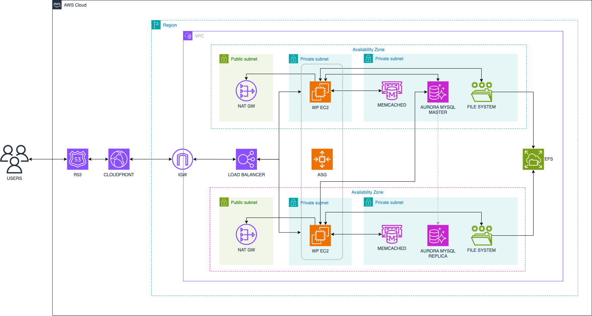

# Despliegue de un WordPress en Alta Disponibilidad con Terraform en AWS

Este repositorio contiene un flujo de trabajo básico para desplegar un entorno de WordPress en alta disponibilidad en AWS utilizando Terraform y Makefile. La configuración está orientada a facilitar la gestión y despliegue de recursos, permitiendo ejecutar los comandos de Terraform de forma más sencilla.

## 🚀 Funcionalidades

- **Automatización con Makefile:** Comandos para inicializar, validar, planificar, aplicar y destruir recursos en AWS con Terraform.
- **Gestión de recursos en AWS:** Configuración para despliegue de redes, bases de datos, almacenamiento y más.
- **Reportes de costos:** Generación de reportes de costos con Infracost para visualizar el impacto financiero de la infraestructura antes de su implementación.

## 🖼️ Arquitectura del Proyecto

A continuación, se muestra un diagrama de la arquitectura del despliegue:



## 📋 Requisitos

- [Terraform](https://www.terraform.io/downloads.html) instalado.
- [AWS CLI](https://aws.amazon.com/cli/) configurado con perfiles de autenticación.
- [Make](https://www.gnu.org/software/make/) instalado.
- [Infracost](https://www.infracost.io/docs/) configurado para análisis de costos.

## 📂 Estructura del Repositorio

La estructura del repositorio organiza los recursos por tipo para una fácil navegación:


## 🔧 Configuración Inicial

### 1. Clonar el repositorio

Primero, clona el repositorio en tu máquina local:

```bash
git clone https://github.com/francotel/wordpress-ha-terraform-aws.git
cd wordpress-ha-terraform-aws
```

## ⚙️ Uso

### Inicializar el entorno
Inicializa Terraform para configurar los plugins necesarios.

```bash
make tf-init env=<env>
```

### Planificar la infraestructura
Crea un plan de ejecución que muestra los cambios que se aplicarán.

```bash
make tf-plan env=<env>
```

### Aplicar cambios
Aplica los cambios planificados en la infraestructura.

```bash
make tf-apply env=<env>
```

### Destruir infraestructura
Elimina todos los recursos creados.

```bash
make tf-destroy env=<env>
```

### Generar reporte de costos
Genera un reporte de costos utilizando Infracost para evaluar el impacto financiero de los cambios.

```bash
make infracost

make infracost-html
```

## 📝 Notas
Asegúrate de definir correctamente los perfiles de AWS y ajustar las variables de Terraform según tu entorno.
El despliegue se ha probado en la región us-west-1, pero se puede adaptar a otras regiones ajustando las variables y configuraciones.

## 📢 ¡Sígueme y Apóyame!

Si encuentras útil este repositorio y quieres ver más contenido similar, ¡sígueme en LinkedIn para estar al tanto de más proyectos y recursos!

[](https://www.linkedin.com/in/franconavarro/)

Si deseas apoyar mi trabajo, puedes invitarme a un café. ¡Gracias por tu apoyo!

[](https://buymeacoffee.com/francotel)
